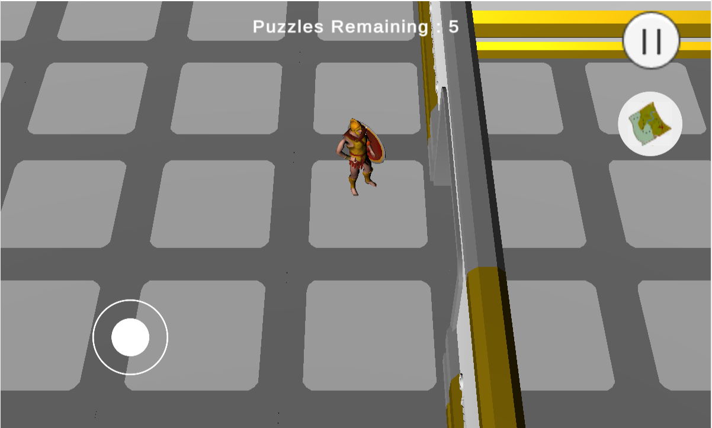
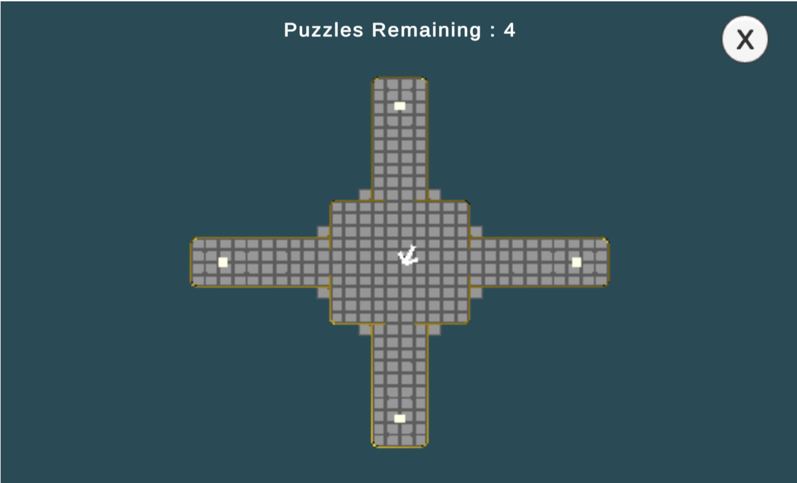
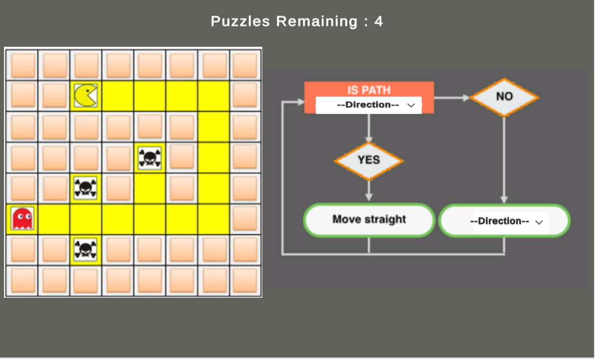
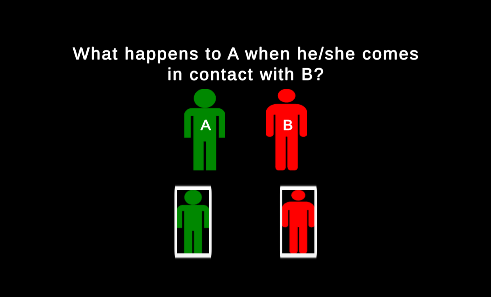
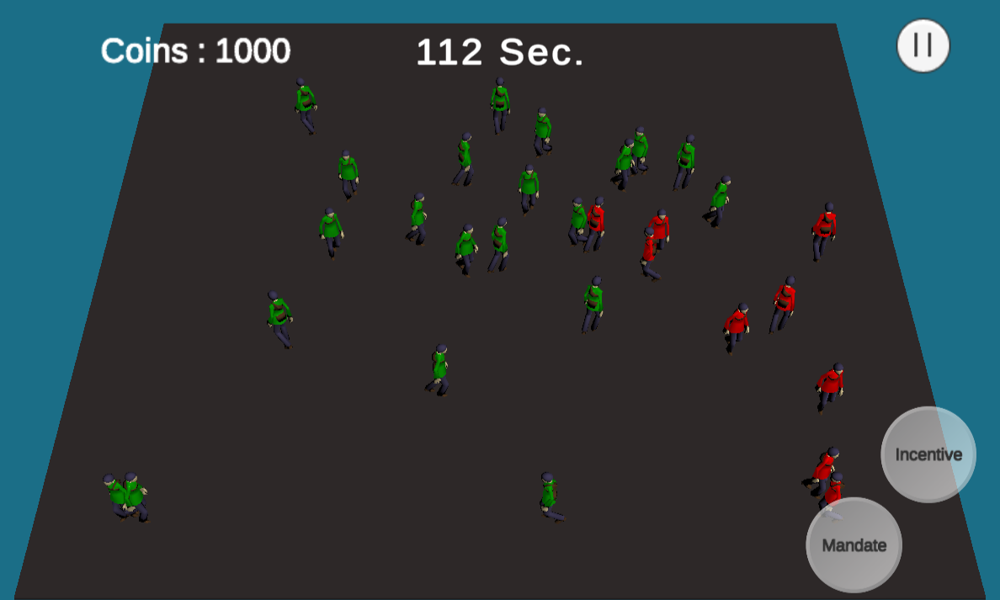

## It contains all the code scripts used to make Decoders game.

# Can You Decode This? The Game
> An Educational Game focused upon analyzing and improving Computational Thinking in children.

* The game has 2 main phases
* Phase 1 consists of 5 puzzles based upon pseudo coding.
* Phase 2 simulates spread of an infectious virus in a marketplace and the player has to eliminate the dange using tools provided.
* All the data collected is stored in a remote server for the later analysis.
* Tech Stack: C#, Unity3D, Blender, Microsoft PlayFab

### The project is deployed at - [Can You Decode This? The Game](https://owais-ali.itch.io/decoders) . Check it out!!

## Screenshots

Phase 1 Gameplay.

The Map feature for the location of puzzles.

One of the puzzles which tries to teach about conditionals using pseudo coding.

A short quiz to identify if the player understands how the virus spread works.

Phase 2 Gameplay.
